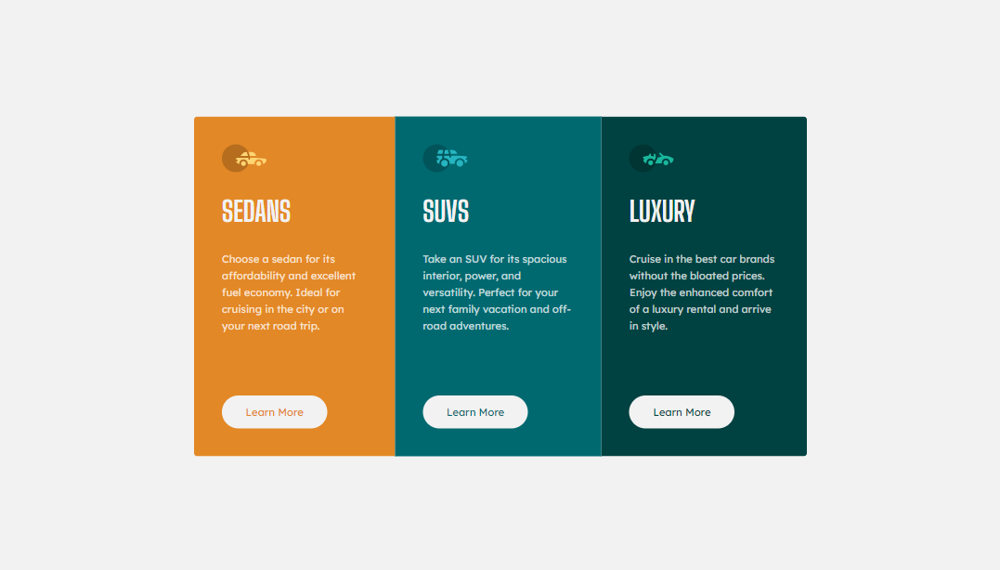

# Frontend Mentor - 3-column preview card component solution

This is a solution to the [3-column preview card component challenge on Frontend Mentor](https://www.frontendmentor.io/challenges/3column-preview-card-component-pH92eAR2-).

## Table of contents

- [Overview](#overview)
  - [Challenge](#challenge)
  - [Screenshot](#screenshot)
  - [Links](#links)
- [My process](#my-process)
  - [Built with](#built-with)
  - [What I learned](#what-i-learned)
  - [Continued development](#continued-development)
- [Author](#author)

## Overview

### Challenge

Users should be able to:

- View the optimal layout depending on their device's screen size.
- See hover states for interactive elements.

### Screenshot

### Links

- Solution URL: [See the code on GitHub](https://github.com/KristinaRadosavljevic/3-column-preview-card-component)
- Live Site URL: [View live site](https://3-column-preview-card-component-kappa-eight.vercel.app/)

## My process

### Built with

- Semantic HTML5 markup
- CSS/Sass
- Flexbox

### What I learned

This was another very simple challenge which only gave me some further opportunity to practice what I already know.

One thing I did learn was how to override the `justify-content` property on one of the flex items - [this Stack Overflow thread](https://stackoverflow.com/questions/23621650/how-to-justify-a-single-flexbox-item-override-justify-content) gave me the idea to use `margin-top: auto;` on the buttons to keep them in line when the paragraphs above them are not all the same height.

### Continued development

In the future projects, I would like to focus a bit more on practicing CSS grid and not just flexbox.

## Author

- LinkedIn - [Kristina Radosavljevic](https://www.linkedin.com/in/radosavljevic-kristina/)
- GitHub - [KristinaRadosavljevic](https://github.com/KristinaRadosavljevic)
- Frontend Mentor - [@KristinaRadosavljevic](https://www.frontendmentor.io/profile/KristinaRadosavljevic)
